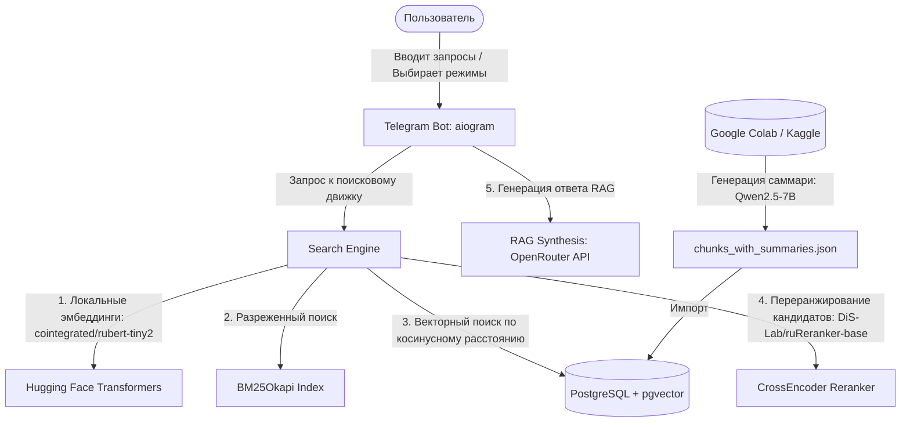

# Обзор проекта: Relationships Psychology Assistant (Ассистент по Психологии Отношений)

Этот документ содержит полное техническое и функциональное описание проекта. Вы можете передать его любому AI-агенту (разработчику, аналитику данных или архитектору) для быстрого введения в курс дела и начала совместной работы.

---

## 1. Основная идея и философия

**Главный девиз:** *«Знания из сотен лекций — в одном умном окне поиска».*

**Идея проекта:**  
Создать интеллектуального ассистента в виде Telegram-бота, способного осуществлять поиск, анализ и обобщение информации на основе обширной базы видеолекций известного психолога отношений Максима Вердикта. Проект решает проблему быстрого поиска нужной информации и ответов на сложные жизненные вопросы по транскриптам видеоматериалов с помощью передовых технологий гибридного поиска (Hybrid Search), плотного векторного поиска (Dense Retrieval) и генеративного ИИ по методологии RAG (Retrieval-Augmented Generation).

---

## 2. Архитектура и стек технологий

Система разворачивается локально с помощью **Docker Compose** для базы данных и Python-окружения для работы бота и ML-моделей:

### Стек технологий:
*   **СУБД:** PostgreSQL 15 + расширение **pgvector** (для быстрого поиска ближайших векторов методом косинусного расстояния).
*   **Backend & Search:** Python 3.12+ / SQLAlchemy (ORM) / Alembic (миграции БД).
*   **NLP & Embeddings:** 
    *   `transformers` (Hugging Face) и локальная модель `cointegrated/rubert-tiny2` (размерность вектора — 312) для генерации эмбеддингов запроса.
    *   `rank-bm25` (BM25Okapi) для текстового сопоставления ключевых слов.
    *   `sentence-transformers` и модель `DiS-Lab/ruReranker-base` для высокоточного семантического переранжирования кандидатов.
*   **RAG LLM:** OpenRouter API (по умолчанию используется модель `openai/gpt-oss-120b` или аналогичная) для генерации структурированных ответов.
*   **Telegram Bot UI:** Python / `aiogram` (v3+) с поддержкой FSM (Finite State Machine) для переключения режимов поиска.
*   **Инфраструктура:** Docker Compose (для контейнера PostgreSQL/pgvector), Alembic (версионирование структуры таблиц).

---

## 3. Функциональные модули и домены данных

Данные хранятся в PostgreSQL в виде двух связанных таблиц через SQLAlchemy ORM:

### A. Базовые видеоматериалы (`Video`)
*   **Описание:** Метаданные исходных YouTube-видеолекций.
*   **Поля:** `video_id` (первичный ключ), `title` (название лекции), `url` (прямая ссылка на видео), `upload_date` (дата загрузки), `view_count`, `like_count`, `tags` (массив тегов), `description` (описание видео), `full_text` (полный текстовый транскрипт видео).

### B. Сегментированные фрагменты лекций (`Chunk`)
*   **Описание:** Разбитые на части (сегменты) тексты видеолекций для точечного поиска и генерации RAG-контекста.
*   **Поля:**
    *   `id` (первичный ключ).
    *   `video_id` (внешний ключ со связью CASCADE).
    *   `source` (название раздела или подтемы).
    *   `start_time` и `end_time` (таймкоды начала и конца фрагмента в секундах).
    *   `text` (исходный текст сегмента).
    *   `embedding` (векторное представление текста размерностью 312).
    *   `summary` (краткое саммари сегмента, генерируемое LLM).
    *   `key_points` (массив ключевых тезисов из сегмента, генерируемый LLM).

### C. Модуль предобработки и обогащения данных (`scripts/colab_summarizer.py`)
*   Предназначен для запуска на GPU (Google Colab / Kaggle).
*   Использует мощную инструктивную модель `Qwen/Qwen2.5-7B-Instruct` для извлечения краткой сути (`summary`) и списка ключевых тезисов (`key_points`) для каждого фрагмента.
*   Поддерживает систему автосохранения (checkpointing) для безопасного возобновления процесса в случае сбоя или лимитов времени среды выполнения.

---

## 4. Алгоритмы поиска и RAG

Поисковый движок (`src/search.py`) реализует 4 режима поиска:

1.  **Строгий поиск (Strict Search):**
    *   Выполняет регулярное выражение (Regex `~*`) в PostgreSQL по всему тексту фрагментов.
    *   При отсутствии результатов переходит на обычный поиск по подстроке (`ilike`), а затем ищет совпадения в саммари и ключевых тезисах.
    *   Подсвечивает найденные ключевые слова в интерфейсе Telegram с помощью тегов HTML `<u><b>`.
2.  **Семантический поиск (Semantic Search):**
    *   Кодирует пользовательский запрос в вектор с помощью локальной модели `rubert-tiny2`.
    *   Находит ближайшие векторы в базе данных с помощью оператора косинусного расстояния (`cosine_distance`).
    *   Применяет фолбек-поиск (Fallback Search) по ключевым словам, если векторный поиск не вернул результатов.
3.  **Комбинированный поиск (Combined Search + RRF + Re-ranking):**
    *   Извлекает топ-50 кандидатов через семантический векторный поиск.
    *   Параллельно извлекает топ-50 кандидатов через классический разреженный поиск BM25 по токенизированным словам.
    *   Объединяет результаты с помощью алгоритма **Reciprocal Rank Fusion (RRF)**.
    *   Если включена опция `USE_RERANKER`, переранжирует топ-25 кандидатов с помощью Cross-Encoder модели `DiS-Lab/ruReranker-base`, отбирая наиболее точные совпадения.
4.  **RAG-Ассистент (ИИ-Ассистент):**
    *   На основе комбинированного поиска отбирает наиболее релевантные фрагменты лекций.
    *   Формирует контекст и отправляет запрос к OpenRouter API с подробным системным промптом.
    *   ИИ генерирует развернутый ответ, ссылаясь на первоисточники в виде кликабельных HTML-ссылок с таймкодами (например, `https://youtube.com/watch?v=...&t=120`).
    *   Специальный парсер `sanitize_telegram_html` фильтрует и переформатирует разметку под строгие ограничения HTML-парсера Telegram (удаляет неподдерживаемые теги `<ul>`, `
`, ` `).

---

## 5. Чем агент может помочь в этом проекте?

Любой новый AI-агент может эффективно подключиться к следующим задачам:

### 🛠 Разработка и расширение функционала (Coding):
1.  **Telegram Bot (aiogram):**
    *   Оптимизация пагинации и отображения результатов поиска (например, добавление инлайн-кнопок для переключения страниц результатов).
    *   Реализация механизма сохранения истории запросов пользователей.
    *   Добавление административной панели для мониторинга нагрузки и логов прямо в Telegram.
2.  **Поисковый движок (Search & ML):**
    *   Интеграция более тяжелых моделей эмбеддингов или бенчмаркинг текущих решений.
    *   Настройка весов слияния BM25 и векторного поиска.
    *   Добавление автозаполнения (auto-suggest) при вводе запроса.
3.  **База данных и инфраструктура:**
    *   Оптимизация производительности векторного индекса (например, добавление HNSW-индекса в pgvector).
    *   Улучшение структуры миграций Alembic.

### 📊 Анализ данных и контента (Data Science):
*   Создание скриптов для кластеризации видео по темам (например, тематическое моделирование LDA или BERTopic на основе полных текстов лекций).
*   Аналитика популярных запросов пользователей для выявления наиболее востребованных тем.
*   Улучшение промптов суммаризатора в Google Colab для повышения точности выделения тезисов.

### 🧪 Тестирование и DevOps:
*   Написание юнит-тестов для проверки корректности комбинированного поиска (сравнение результатов до и после изменений в ранжировании).
*   Добавление интеграционных тестов с моками API OpenRouter.
*   Настройка автозапуска Docker-окружения для локальной разработки.
